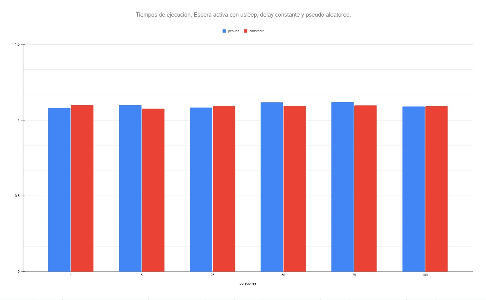
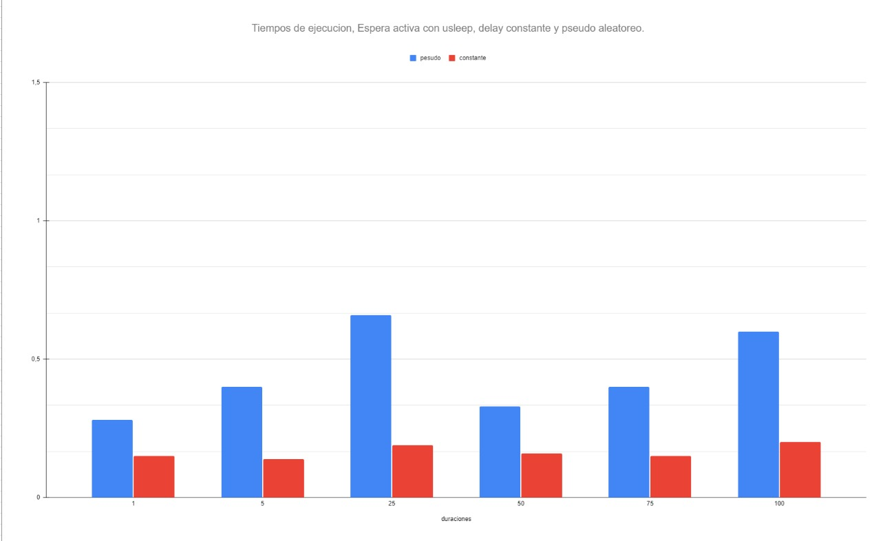

Espera activa con retraso. ¿Se corrige el problema de la espera activa si en 
lugar de tener un ciclo vacío, se espera un cierto tiempo? Copie su carpeta 
ejemplos/pthreads/hello_order_busywait a ejercicios/pthreads/delayed_busy_wait.
 Permita que el usuario pueda invocar su programa dos argumentos de línea de 
 comandos: la cantidad de hilos a crear, y la cantidad de microsegundos a 
 esperar cuando no es el turno del hilo de ejecución.

Espera activa con retraso constante. Si no es el turno de un hilo, 
éste espera una cantidad constante de microsegundos, algo como:

Recuerde probar la calidad de su código (sanitizers, linter). Luego ejecute al 
menos tres veces su solución (sin sanitizers) con la cantidad máxima de hilos 
de ejecución que su sistema operativo le permite crear y una espera de 50µs.
Escriba en el readme.md del ejercicio la mayor de las duraciones que obtuvo de 
sus corridas. 
¿Hubo una mejora de la espera constante respecto a la espera activa pura?

### R: 
Si, hubo una mejora bastante notable con respecto a la espera activa pura.

Espera activa con retraso pseudoaleatorio. Altere su solución al ejercicio 
para que en lugar de esperar exactamente la cantidad de microsegundos indicada 
por el usuario, espere por una cantidad pseudoaleatoria de microsegundos cuyo 
límite es el número indicado por el usuario en el segundo argumento de línea de 
comandos. Sugerencia: puede usar compilación condicional para implementar esta 
variación.

Ejecute al menos tres veces su solución pseudoaleatoria con la cantidad máxima 
de hilos y un máximo de espera de 50µs. Tome la mayor de las duraciones. 
¿Hubo una mejora de la espera pseudoaleatoria respecto a la espera constante?

### R:
En este caso, la espera pseudoaleatoria tiene un mayor tiempo de ejecución en comparación a su espera constante.

Comparación de las esperas. ¿Mejora el tiempo de ejecución de los dos tipos 
de esperas (constante y pseudoaleatoria) si disminuye o incrementa la 
espera máxima de los hilos? Haga al menos un par de ejecuciones con al menos 
los siguientes tiempos de espera:

1µs

5µs

25µs

50µs

75µs

100µs

Agregue la gráfica al readme.md del ejercicio y una discusión de a lo sumo 
dos párrafos. Indique cuál fue el mejor tiempo máximo de espera obtenido y los 
efectos de disminuir o incrementarlo. Conjeture y trate de explicar por qué 
ocurre este comportamiento. 

### Ryzen 7 - 5700G - Ubuntu Linux

## R
El mejor tiempo de espera obtenido fueron 1,076388584s, en el programa con 
tiempo constante. 

A mayor número de hilos, el programa con números pseudo aleatorios llega a tener
un mejor tiempo, sin embargo. Este está tan igulado con el tiempo constante
porque el generar una semilla random y un número random de microsegundos
aumenta bastante el tiempo de ejecución de este mismo. Sin embargo, entre más
hilos se agreguen, este tendrá una mayor ventaja con respecto a su velocidad

### i5 - 8250U - Linux Mint

En este caso, al ser un procesador menos pontente, se decidió el utilizar una 
mejor cantidad de hilos para ver como se comportaba el programa, los hilos
usandos fueron 2000.

En este ejemplo, la carga de trabajo extra de que realiza la versión con números pseudoaleatorios causa una gran pérdida de rendimiento en comparación al tiempo constante, este al no contar con esas instrucciones extras se ve beneficiado
en cuento a rendimiento. 

Finalmente indique si la espera activa con retraso 
es una solución óptima, y en caso negativo, provea una idea que pueda 
lograr este ideal.

### R

La espera activa con retraso, es mejor que la espera activa normal, de eso no 
hay duda. Sin embargo, una espera activa nunca será una solución óptima y ni la
mejor solución posible, ya que el costo de recursos en cuento a procesador de 
esta misma suelen ser excesivos, en la mayoría de casos siempre llevandolo al
máximo. Existen alternativas como los semaforos y MUTEX que nos
aseguran una mayor eficiencia y estabilidad en a la hora de ejecutar el código. 

