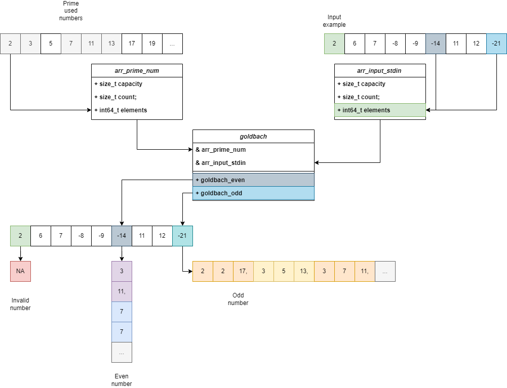

# Golbach Serial: UML Diagram



## Summary

In this image, we can observe the program's functionality.

Initially, two data structures are created to store sets of numbers, which we will refer to as Arrays for simplicity. 

One is called ```arr_prime_num```, which contains all prime numbers up to the largest input in the array provided by the user, referred as ```arr_input_stdin```.


We have three cases: the invalid case, even, and odd.

- Invalid: If the number is <= 5; The program will print ```NA```. 

- Even: In this case, the number is ```14``` or ```-14```, indicating that we need to print the sums. So, in this case, we create an array where every 2 spaces will contain a sum for this number. In this case, numbers are ``` 3, 11 ``` and ``` 7, 7 ```

- Odd: Similarly to the previous case, in the scenario with odd numbers, we'll also create an array containing the sums of the entered number, in this case, ```-21```. The only difference from the previous case is that we need to handle ```3 slots``` for the sums instead of 2.