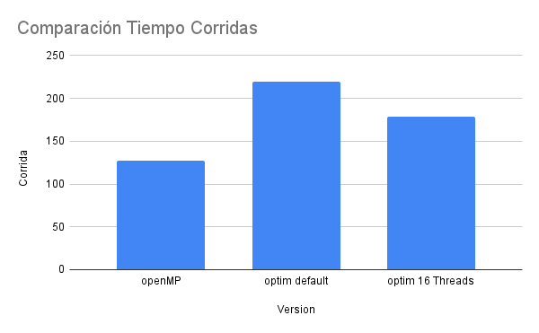
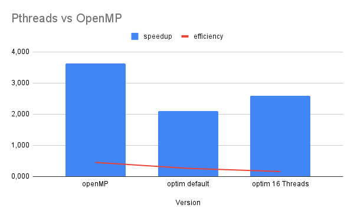
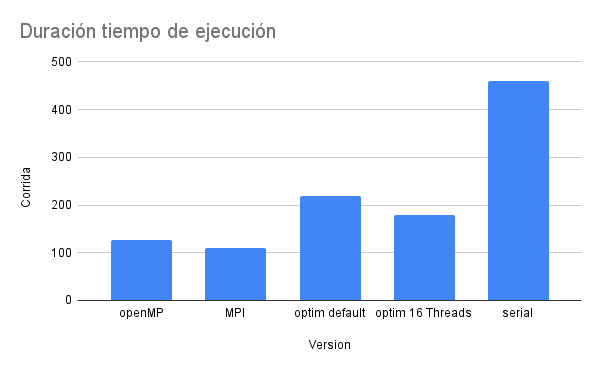
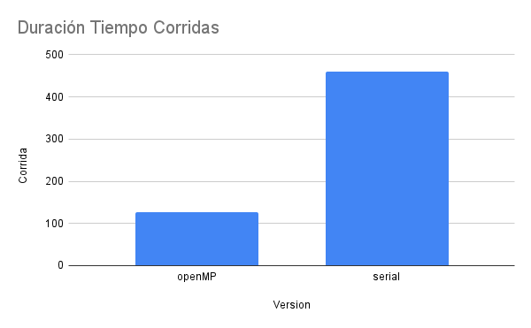
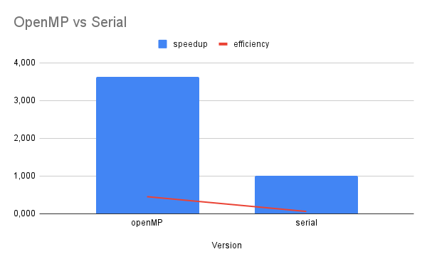
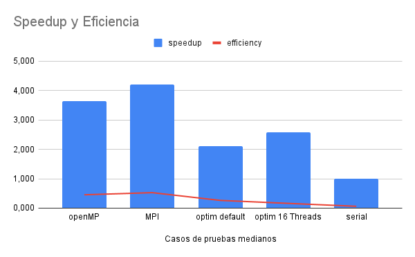

# Report

## Creditos
- Estudiante: Juan Diego Soto Castro
- Correo: juan.sotocastro@ucr.ac.cr
- Carnet: C07722

## Resumen
Este documento de reporte resume las pruebas realizadas tanto para Goldbach_MPI y Goldbach_openMP.

Procesador: i5-8600 @ 3.10Gz x 6.

RAM: 16GB.

Sistema operativo: Ubuntu, con uso mínimo.

## 4.3. Comparación Pthreads-OpenMP

Esta primera comparación entre Pthreads y OpenMP nos muestra un aumento significativo en el rendimiento del programa. La versión original con Pthreads tarda 219.1 segundos, mientras que la versión con 16 hilos reduce este tiempo a 178.2 segundos. Sin embargo, al usar OpenMP, el tiempo se reduce aún más a tan solo 126.8 segundos. Esto representa un speedup de 3.631 y una eficiencia de 0.454 para OpenMP. Por otro lado, la eficiencia de las versiones con Pthreads y Pthreads con 16 hilos era de 0.263 y 0.161, respectivamente.

## 4.5. Comparación OpenMP-MPI

Se puede observar arriba el tiempo de ejecución de todas las corridas. En este caso, la que obtuvo el menor tiempo de duración fue MPI. Como era de esperar, esta se encuentra muy por encima de la versión serial, con un speedup de 4.212 y una eficiencia de 0.527.

Sin embargo, cabe destacar que la versión MPI fue ejecutada en una máquina local y no en un servidor o clúster. En este tipo de equipos, se esperaría que su rendimiento aumente aún más en comparación con la versión serial.

Comparando todas las versiones, la que cuenta con el mejor uso de recursos y un speedup más alto es la versión MPI. En segundo lugar, se encuentra la versión OpenMP, con un speedup de 3.631 y una eficiencia de 0.454, superior a la versión optimizada de Pthreads y a la versión de Pthreads con 16 hilos.

En conclusión, los gráficos presentados evidencian claramente las ventajas del uso de MPI y OpenMP en comparación con las versiones Pthreads y serial. La optimización y paralelización del código son cruciales para mejorar el rendimiento y eficiencia en sistemas de cómputo de alto rendimiento.