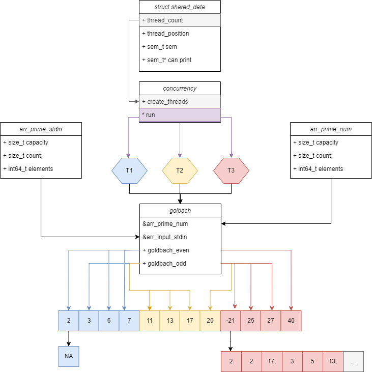

# Golbach Pthreads: UML Diagram



## Summary

In this image, we can observe the program's functionality.

Initially, two data structures are created to store sets of numbers, which we will refer to as Arrays for simplicity. 

One is called ```arr_prime_num```, which contains all prime numbers up to the largest input in the array provided by the user, referred as ```arr_input_stdin```.

We have three cases: the invalid case, even, and odd.

- Invalid: If the number is <= 5; The program will print ```NA```. 

- Even: In this case, the number is ```14``` or ```-14```, indicating that we need to print the sums. So, in this case, we create an array where every 2 spaces will contain a sum for this number. In this case, numbers are ``` 3, 11 ``` and ``` 7, 7 ```

- Odd: Similarly to the previous case, in the scenario with odd numbers, we'll also create an array containing the sums of the entered number, in this case, ```-21```. The only difference from the previous case is that we need to handle ```3 slots``` for the sums instead of 2.


## Concurrency Integration

To enhance performance, the program has been augmented with concurrency. Here's how it works:

- **Shared Data Structure**: A shared data structure is defined to store the necessary information for processing Goldbach calculations and synchronizing output.
  
- **Thread Initialization and Semaphore Creation**: Threads are created using the pthread library, and semaphores are utilized for synchronization between threads. Semaphores ensure that only one thread prints output at a time to avoid race conditions.

- **Thread Execution Function**: Each thread executes a function responsible for processing a portion of the input data and generating Goldbach partitions. The function accesses and modifies the shared data structure as needed.

- **Thread Synchronization**: Mechanisms such as semaphores or mutexes are used to synchronize access to shared data and prevent race conditions when multiple threads operate on the same data.

- **Resource Cleanup**: Upon completion, all resources, including memory and semaphores, are released to avoid memory leaks and ensure proper system cleanup.
