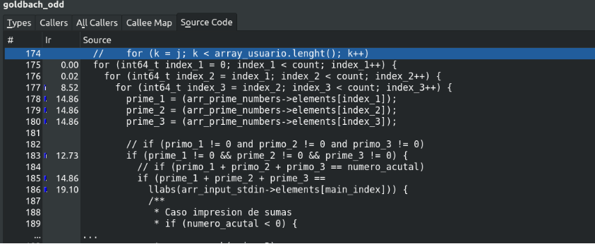
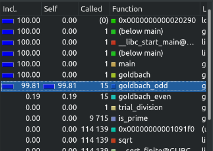
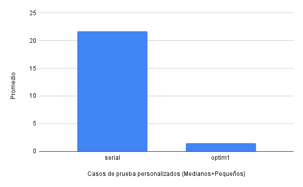
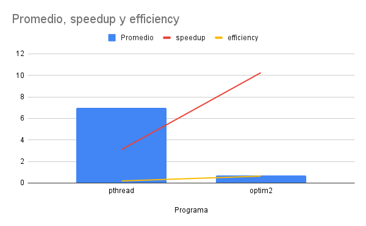
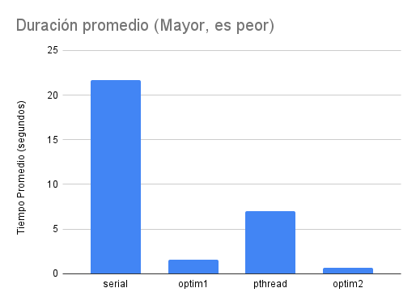
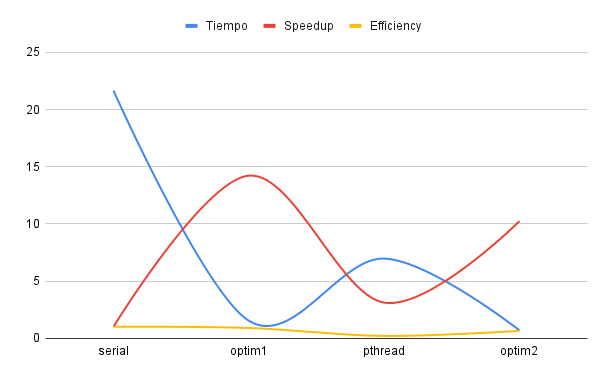
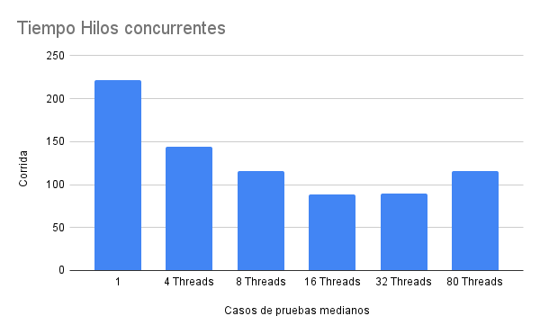
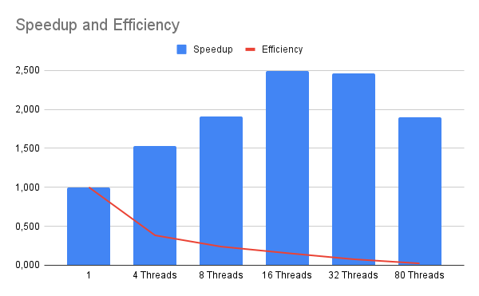

# Report

## Creditos
- Estudiante: Juan Diego Soto Castro
- Correo: juan.sotocastro@ucr.ac.cr
- Carnet: C07722

## Resumen
Este documento de reporte resume las optimizaciones realizadas tanto para Goldbach_Serial y Goldbach_Pthread.

Procesador: i5-8250U @ 1.60GHz x 4.

RAM: 8GB.

Sistema operativo: Linux Mint, con uso mínimo.

## 3.5. Optimización 1: Serial

Como se puede observar en el análisis que nos provee Kcachegrind, en la función `goldbach_odd` se consume la mayor parte de los recursos de este programa.

El código optimizado introdujo las siguientes mejoras:

1. **Eliminación de Condiciones Redundantes**: En el código original, hay verificaciones redundantes para asegurarse de que los números primos no sean cero `(if (prime_1 != 0 && prime_2 != 0 && prime_3 != 0))`, lo cual es innecesario ya que, por definición, los elementos en `arr_prime_numbers` deben ser primos y, por tanto, no pueden ser cero.

2. **Reducción del Espacio de Búsqueda**: En el código optimizado, se añade una condición de ruptura `(break)` en los bucles anidados para evitar iteraciones innecesarias. Si la suma de los primeros dos primos (`prime1 + prime2`) o la suma total (`prime1 + prime2 + prime3`) supera al número actual (`current_num`), se interrumpe el bucle correspondiente. Esto reduce significativamente el número de iteraciones, especialmente cuando los números primos son grandes. Esta mejora fue fundamental e introdujo un `speedup de 14.2`.

## 3.5. Optimización 2: Mapeo Dinámico
En la versión Pthreads de Goldbach, el código utiliza un mapeo estático, 
con el uso de semáforos y mutex para sincronizar las impresiones. 

En este código, no se implementó una versión con mapeo dinámico, sin embargo, 
se realizaron otras mejoras al código para mejorar tanto la eficiencia y speedup
en comparación con la versión Pthreads y la versión Serial.

1. **Las mismas correcciones que se agregaron en la versión serial.**

2. Ambas funciones `goldbach_even` y `goldbach_odd` ahora limitan el espacio 
de búsqueda mediante condiciones de ruptura `(break)`.

3. Además, se agrupa la lógica de la suma y la comparación en una única operación
para simplificar el flujo del programa. 

4. La gestión de errores se mejora mejorando el tiempo de inserción en `arr_goldbach`.

En esta gráfica se representa en azul, el tiempo promedio de duración de las 
corridas, con un speedup de 10,2 puntos y una eficiencia del 0.64

## 3.8. Comparación de Optimizaciones

Como se puede observar en este gráfico, la versión serial ocupa el mayor tiempo,
seguida de la versión Pthread, la versión serial optimizada y la versión Pthread 
optimizada, siendo esta última la más rápida.

El speedup obtenido entre la versión Serial y Pthread es de `3.1`, con una 
`eficiencia de 0.19`.

Por otro lado, la versión Serial - Serial Optimizada cuenta con un 
`speedup de 14.2`, con una `eficiencia de 0.89`, haciéndola la ganadora de este
 test, aunque no sea la más veloz, cuenta con el mejor ratio de 
 speedup/eficiencia.

Comparar la versión Serial - Pthread Optimizada no tiene mucho sentido, ya que 
se obtiene un `speedup de 31.9` y una `eficiencia de 1.99`. Sabemos que la 
eficiencia debe estar entre `[0-1]`, por esta razón, tiene más sentido realizar 
una comparación entre Pthread y Pthread Optimizada.

En este caso, se obtiene un `speedup de 10.2` y una `eficiencia de 0.64`, 
haciéndola la segunda mejor en cuanto a speedup/eficiencia se refiere.

Sin embargo, en el siguiente test se verá el funcionamiento del programa de 
manera concurrente y lo poderoso que puede llegar a ser comparado con la 
versión serial.

## 3.9. Comparación 02: Grado de Concurrencia

Como se puede observar en el gráfico, un único hilo ocupa la mayor cantidad de 
tiempo en  procesar los datos, como es de esperar. Sin embargo, conforme se va
aumentando la cantidad de hilos, el programa empieza a mejorar su rendimiento, 
llegando a su máximo desempeño a los 16 hilos creados. Este número de hilos,
que permiten el mayor desempeño, está sesgado por la cantidad de solicitudes que
se lo hicieron al programa, en este caso eran 20. 

Una vez alcanzada esta marca, el rendimiento del programa empieza a empeorar, ya
que el proceso de creación de hilos que sobrepasa la cantidad de datos que se le
dió al programa para trabajar, lo cual empieza a pasar factura empeorando su 
desempeño cada vez que se le agregan más hilos.

En este gráfico, donde se puede observar el speedup y la eficiencia del programa, 
se nota que conforme se crean más hilos, el programa empeora tanto su 
eficiencia como su desempeño.

Sin embargo, esto es en este caso de prueba, que tenía alrededor de 20 
solicitudes. Si se llegara a aumentar el número de solicitudes a más de 80, 
este programa obtendría un mejor desempeño cuántos más hilos tenga disponibles, 
ya que estaría aprovechando desde el principio todos los hilos que fueron creados.

En conclusión, la configuración de 16 hilos es óptima en términos de lograr la 
mayor aceleración y el tiempo de ejecución más rápido. Sin embargo, si la 
eficiencia (utilización de recursos) es la prioridad, 
la configuración de 4 hilos es la mejor opción. 
En general, 16 hilos logran el mejor equilibrio entre velocidad y utilización de
 recursos para los datos proporcionados.